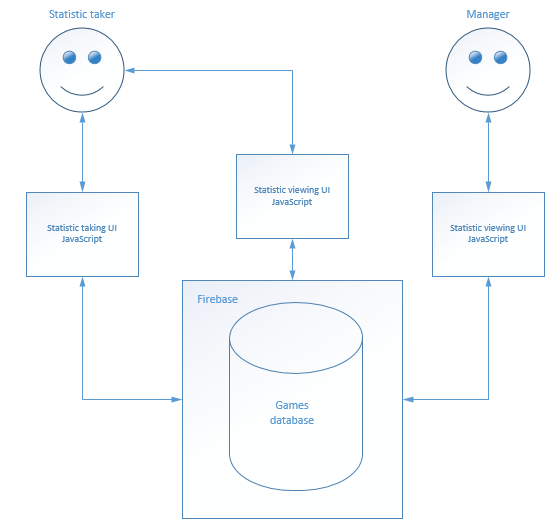
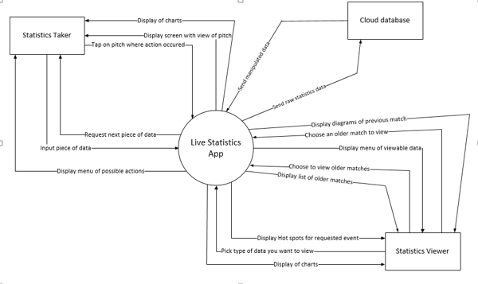
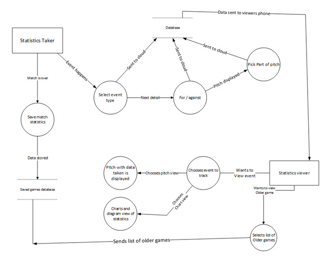
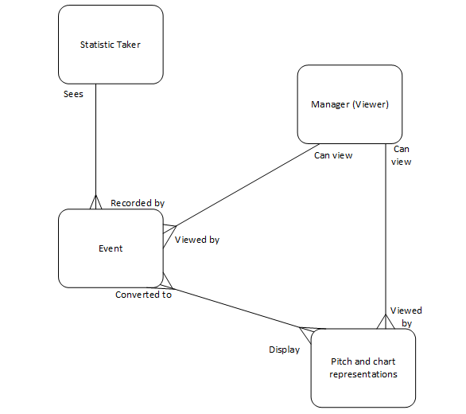
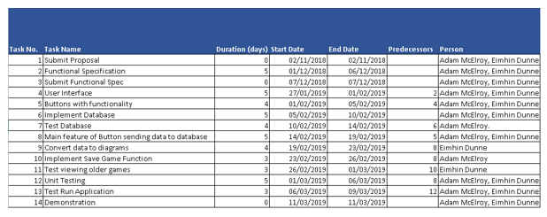
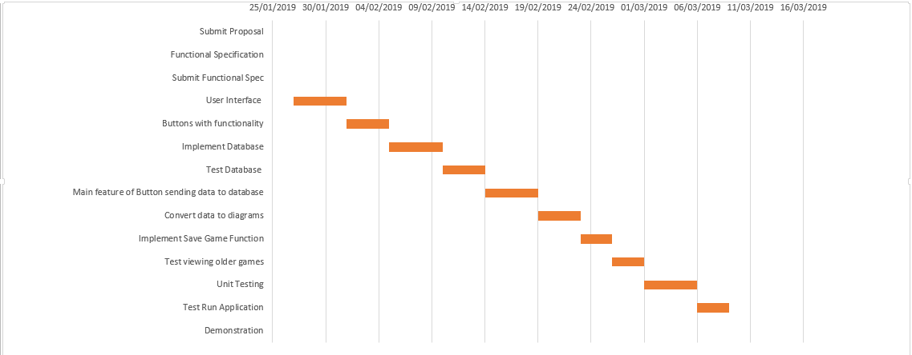

## CA326 ##

## Live Statistics ##

# Adam McElroy

# Eimhin Dunne

# Supervisor: Dr. Mark Roantree

# Functional Specification Document

## Functional Specification for 3rd  Year Project ##

### **Table of Contents** ###

**Content**

**1. Introduction**

1.1 Overview

1.2 Business Context

1.3 Glossary

**2. General Description**

2.1 Product / System Functions

2.2 User Characteristics and Objectives

2.3 Operational Scenarios

2.4 Constraints

**3. Functional Requirements**

3.1 Creating a club key

3.2 Creating a statistics taker key

3.3 Finding/Creating a match

3.4 Taking statistics

3.5 Viewing the statistics live

3.6 Finding a match that is over

3.7 Viewing the statistics after a game

**4. System Architecture**

**5. High-Level Design**

**6. Preliminary Schedule**

**7. Appendices**

## 1. Introduction ##

### 1.1 Overview ###

The product we are developing is a sports statistics application for GAA matches. The application will allow a user to input data on a mobile phone such as turnovers in play, where frees are being won on the pitch, where scores are coming from and more. This data will then be sent up to a cloud database where it can be retrieved from a second device.

The data will be manipulated and when it is retrieved on the second device it will be displayed as easy to read diagrams. The main view will be of a GAA pitch and if, for example, there are a lot of turnovers at one part of the pitch this area will start to go red on the second device to indicate it is a hot spot for that event.

The main goal for this app is to be a helpful tool for management staff to monitor a teams performance. We want to make it so that when an event is recorded by the person taking the statistics it is sent to the cloud, retrieved on the second device and converted to diagrams in as close to real time as possible.

### 1.2 Business Context ###

The main business context which relates to this application is as follows:

Managerial / Tactical Use – A manager can use the statistics taken during a game to better understand how they can improve their teams&#39; performance while the game is going on. Lots of clubs would find this information very valuable if proven effective for them. An overview of the game can be viewed when it&#39;s finished so the team can look back at where they went wrong, what they did right and so on. Many professional clubs look back on videos of games to analyze a teams performance. This app will limit the amount of man hours spent on this task as instead of having to tediously skim through a video they can be presented they information which they need on one screen.

### 1.3 Glossary ###

**Firebase** – A database built by Google for mobile development.

**Android Studio** – An IDE for android development which we will be using to build our app.

**Java**  -  Android studios supported programming language.

**Device 1 / Device 2** - Device 1 will be the device taking statistics in any example scenarios. Device 2 will be the one viewing the manipulated statistics.

## 2. General Description ##

### 2.1 Product / System Functions ###

Below are a list of the main functions which we believe need to be implemented in the app. This is not an official list and functions can be added / removed as we progress with the development:

* Find match in progress

* Choose User Type (pick between statistics taking / viewing)

* Generate unique user key

* Validate unique key (If required)

* Switch view (between recording turnovers, where team scores from etc.)

* Record Data

* Send Data (To the cloud database) from device 1

* Retrieve Data (From the cloud database) on device 2

* Analyze data

* Display Graph, Diagram

* Generate clubs key

* Validate clubs key

These functions are the most important functions in order to get this app doing its main tasks. Any other functions which may be added in the course of the development cycle are just for adding nice but not 100% necessary features if we have enough time to implement them.

### 2.2 User Characteristics and Objectives ###

The viewable statistics side of this app will be visible to anyone who has the club key after the game. However the statistics taking side will only be accessible by people who are assigned given the special statistics taker key.

The target audience is intended to be GAA clubs since they will get the most relevant use out of the statistics recorded.

### 2.3 Operational Scenarios ###

Since there is two different types of users for this app there is a range of different operational scenarios that can occur. The tasks carried out on device 1 differ from those on device 2. These operational scenarios are listed below.

**Finding an ongoing/old match for a club**

Upon opening the app a user will be prompted to enter the key for the club they wish to track. Once this has been filled in and validated they will be brought to the next screen.

**Choosing a User Type**

Upon entering a valid club key the user will be prompted to choose what type of user they are. The two options will be a statistics taker or a statistics viewer. If a user chooses to be the one taking statistics they will need to provide a unique user key for this as well which is given to them by the club. This prevents unwanted people gaining access to edit any data which may have been collected.

**Selecting data to collect**

When the user successfully accesses a match they will be brought to the home screen where they can choose what type of data they want to take. There will be multiple buttons to choose from here. Each button will represent an event that may have happened on the pitch such as turnover, score, free won and so on. 

**Selecting for / against**

Once the data type to be recorded is selected the user is then prompted to select was it for or against the team. For example if the data type is point scored, then the user will be asked was the point scored for your team or against your team. If it is a turnover in play then the user will be asked whether your team lost the ball or the opposition did.

**Selecting part of pitch**

Once all of the data from the previous steps has been recorded the user will be brought to a page with a display of a GAA pitch. The pitch will be divided into sections and the user can choose which part of the pitch the said action occurred by simply tapping that section. All of this data will go towards generating a user friendly display on device 2 in the forms of heat maps and diagrams.

**Viewing statistics** 

Once the data from one event on device 1 is collected it is sent to the database where it can in turn be retrieved from device 2. To view an event you follow a similar process to recording one. You can choose what type of event you want to track and a heat map will be displayed of where the team is performing well / poorly for that certain event. This can be done for each different type of event.

**View Previous Statistics**

When a match is over the data recorded in that match can be saved in the app so that it can be viewed in the future if needed. The option for viewing these will be on the home screen for the user. Each saved match can be named as well so putting the date of the match in the title along with the team you were playing will make it easier to find in the future.

**Find Previous Match**

When a user presses the option to view a previous matches statistics they are brought to a page where the previous matches are displayed in a list. There will be a search bar where you can search for a match based on its name for ease of use.

### 2.4 Constraints ###

**Internet connectivity and data allowances**

If internet connectivity is slow in the area where the match is being played then obviously data is going to be sent slowly and retrieved slowly rendering the app not as effective as it should be.

**Ability to input statistics efficiently**

If the UI was not simple enough and or the user was not quick enough entering the match statistics the data could end up being skewed and wrong in the analysis stage.

**Weather conditions**

Bad weather conditions is going to be a factor in the use of this app. People will not want to constantly be holding their phones out if it is pouring rain outside. Not only will this potentially damage their phone but it will make touching the screen to input data a lot more difficult too as the screen becomes less accurate at registering where it has been tapped too which means some statistics could get skewed as they are unintentionally input wrong.

**Battery life**

When the statistic takers phone dies due to lack of charging facilities in a field statistics can't be taken or if a managers phone dies they wouldn't be able to view the statistics which would lead to a breakdown in communication and causing the app to be useless.

## 3. Functional Requirements ##

### 3.1 Creating a club key ###

**Description:** This process involves generating a random key for a clubs games. Once created this key can be given to selected users. Once a user has this key they can enter it on the find match screen to follow a match that the club might be playing. This key can remain the same too so invited users can reuse it every time they want to view a game.

**Criticality:** This is a critical part of the app as it prevents unwanted users from accessing statistics from the club. Such users could be rivals clubs or upcoming opponents who you don't want viewing your teams statistics.

**Technical issues:** A possible technical issue with this feature is the fact that it needs to be constantly available to be checked in the database if other users try access a game because it needs to be matched against their input key to grant or deny access.

**Dependencies with other requirements:**  None

### 3.2 Creating a statistics taker key ###

**Description:** This involves creating a key that can be entered by someone at the user type screen. As mentioned previously to prevent any random person from accessing the ability to modify match data users will need to input another special key made by the club in order to gain privileges to modify the data.

**Criticality:** This is just as critical as the club key as it keeps unwanted people out of knowing your clubs team statistics.

**Technical issues:** The same technical problems can arise from this as in the previous step.

**Dependencies with other requirements:**  None

### 3.3 Finding / Creating a match ###

**Description:**  This step in using this app is to find/create a match for whose statistics you want to track / take. This can be done by entering/creating the clubs key. If a key is created then the game will become live for people to view it. If a key is entered correctly then a user will be brought to the corresponding games home screen where statistics taken can be viewed.

**Criticality:** This function is obviously critical for the system because it is the starting point for the purpose of the app. The user needs a way to specify what match they are looking to view and this is how that is accomplished.

**Technical issues:** The most important things with this step are to make sure that if a key is created that it is successfully stored in the database. This is to ensure that if a person is trying to access a game they can enter their key and it can be compared to the clubs one to grant / deny access.

**Dependencies with other requirements:** If finding a match then a club key has already been made.

### 3.4 Taking Statistics ###

**Description:** The user will have several screens to navigate through. They will select the event that is happening on the field and the app will give options depending on what is picked. If a free is selected there will be two options that follow, for or against and there will be three options after that, score, wide or kept in play.  These selections will be sent to firebase and stored on the database to be later analyzed by the person viewing the statistics.

**Criticality:** This is the most important feature of the system, without it there will be no statistics to view or store in the database. This is the data collection part of the app and everything else in the system is built up around these inputs.

**Technical issues:** This part will have two main challenges and both are to do with speed. The user has to have a simple UI that they can input the events quickly. If they can&#39;t input the data quick enough they will miss events looking at their phone. The second part is how quickly the data is uploaded to the database. If this isn't quick enough management will be looking at data from a few minutes ago which is not relevant at the point in time.

**Dependencies with other requirements:** This will depend on actually finding a game. When you find a game it will give you access to that specific games database and then you can add to the events and other management can view them.

### 3.5 Viewing the statistics live ###

**Description:** Multiple users on different devices will be able to view the data that is brought down from the database on their device. They will be able to choose between hotspot graphical pictures on the GAA field and percentage graphs of selected events. This Will make it easy for the management to see where their team&#39;s weaknesses and strengths are so changes can be made in the game and later worked on in training.

**Criticality:** The ability to be able to see and understand the statistics is very important as the user won't need any training to use the app. For this part the apps UI must be intuitive, straightforward to use, and easy to understand. To get several pieces of data that may not have anything to do with each other but still make them easy to read and understand side by side.

**Technical issues:** The data has to be downloaded and turned into diagrams and graphs quickly to stay up to date with the match that is going on. The UI has to be laid out in such a way that the statistics can be acted on by management and not complicate the decision making.

**Dependencies with other requirements:** The data used in this will rely on two parts of the system. The database and the data. The data the statistics taker inputs will be on the database and without it there would be nothing to view. This data has to be accurate and someone will have to take it. The database will then have to be quick so the data is easily accessible to be turned into usable diagrams.

### 3.6 Finding a match that is over ###

**Description:** When a match is over all of the data recorded will be saved to the database and it can still be viewed at a later date. If a user wants to do this they can select the option from their home screen as there will be a button to take them to this page. They will be able to see all the match events and data in the same format as if the game was live using diagrams and graphs.

**Criticality:** This is not a critical part of the system to function but it is a nice addition as all of the statistics taken in previous games don't go to waste.

**Technical issues:**  This will include a search bar and the ability to filter though the games. The search bar will have to work with different inputs like team name or location and the filter will have to have several built in criteria to narrow down the games. 

**Dependencies with other requirements:** The database will be important to this. It will have to save the data and be able to be looked through as different games.

### 3.7 Viewing the statistics after a game ###

**Description:** Once a user finds the game they are looking for then they can view the statistics as a whole for that game. This will be done in the same way someone can view the statistics while the game is going on except for the fact that all of the data is already there.

**Criticality:** Again this is not a critical part of the system but is there if it is needed for use in the future.

**Technical issues:** A possible issue with this is saving all of the data correctly and making sure that it can&#39;t be manipulated any further once the game is over.

**Dependencies with other requirements:** Viewing statistics from older games will rely on statistics being taken for that game in the first place.

## 4.System Architecture ##

## 5. High-Level Design ##

In this section we displayed our system overview through a few diagrams. Namely a Context diagram, a Data Flow Diagram and lastly a Logical Data Structure. This are spoken about in further detail below.

**Context Diagram**

This diagram show the interaction between the whole system and some external entities. The external entities we have chosen are a statistics taker, viewer and the database. The diagram shows how data is sent to and from the database which is co-operatively done by both devices.

**Data Flow Diagram**

As the name suggests this diagram is to show the flow of data through the system. It shows where data goes and comes from as users partake in a variety of different actions.

**Logical Data Model**

The logical data model shows how a range of different entities in a system interact with each other. This diagram also makes use of cardinality to show how many of one entity interacts with another.

**Context Diagram of LiveStatistics**

**DFD of LiveStatistics**

**LDM of LiveStatistics**

## 6. Preliminary Schedule ##

Our preliminary schedule is outlined below and is accompanied by a corresponding GANTT chart of our work schedule when we start developing.

## 7. Appendices ##

**Research**

[Android Studio Documentation](https://developer.android.com/docs/)

[Firebase Documentation](https://firebase.google.com/docs/)

[Android app that is similar](https://play.google.com/store/apps/details?id=com.gamecenter.football&hl=en)

This app does not display information like ours though.