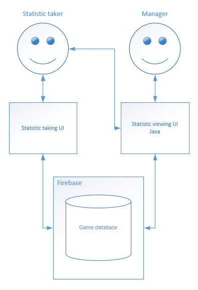
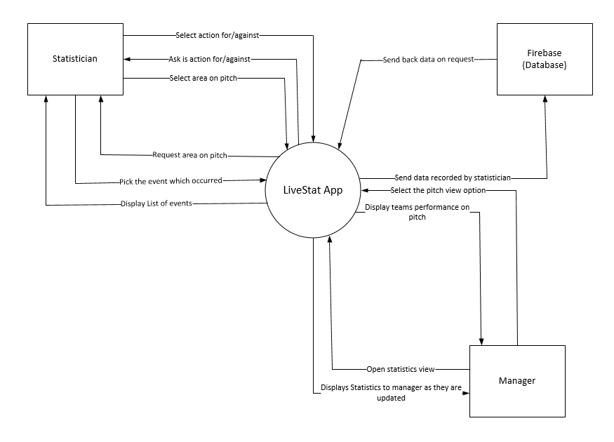
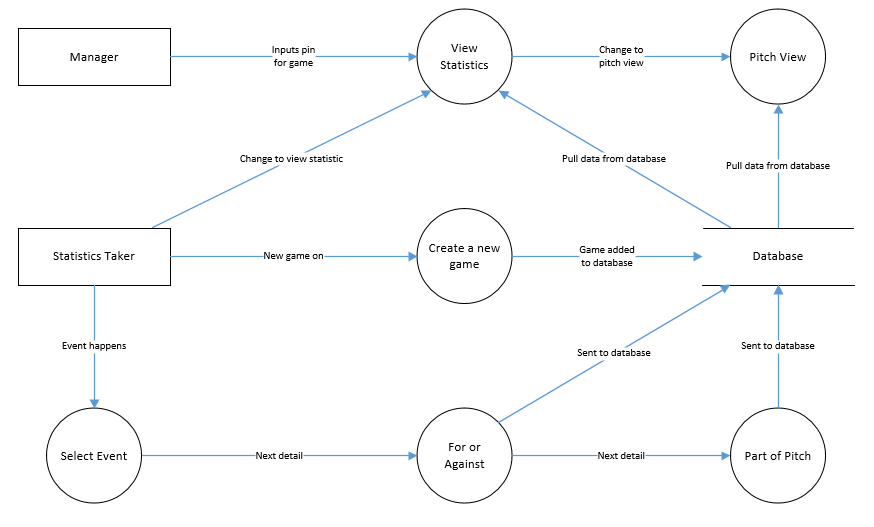
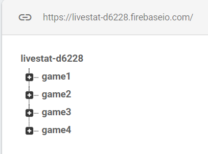
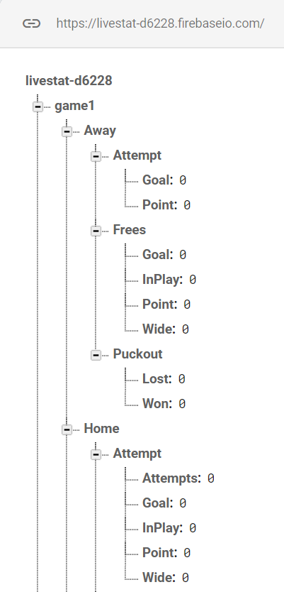
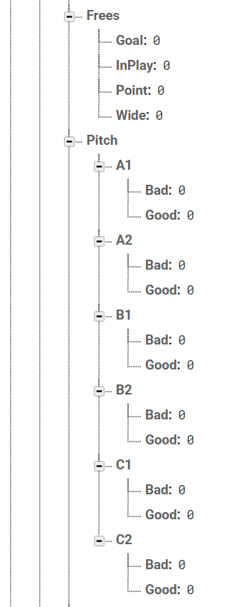

# Live Stat Technical Specification
Eimhin Dunne 16386406
Adam McElroy 16345753
## CA326

### Table of Contents

##### 1.Introduction

- 1.1 Overview
- 1.2 Glossary

##### 2.System Architecture

- 2.1 Client
- 2.2 Database
- 2.3 Product Data

##### 3.High Level Design

- 3.1 Class Diagram
- 3.2 Component Diagram
- 3.3 Data Flow Diagram
- 3.4 Process Diagram
- 3.5 Use Case Diagram
- 3.6 Firebase layout

##### 4.Problems and Resolution

##### 5.Installation Guide

### 1 Introduction

#### 1.1 Overview

Live Stat is a Android application for tracking and recording and reviewing a hurling teams performance. The app is designed to be used by managers and background staff of GAA  teams. The app is divided into two parts, the manager view and statistician view. The manager has the ability to view the events live from the app. The aim is for one user to be able to record events occurring during a game and a second user to be able to view these statistics live as they are happening.  The manager can view these events in different ways. There is a full statistics view which shows the manger a variety of different pieces of information such as how many shots they have successfully scored or how many turnovers they have won compared to how many they have lost, among other things. The other way to view these events is through the pitch view. This is an image of a GAA pitch broken into six segments. These segments change colour based on how the team is performing there. Red indicates you are being outclassed by the opposition in that area, grey indicates a stalemate and green indicates you are performing well in that area. There are three different shades of red to show how badly your team is under-performing in a certain area.

#### 1.2 Glossary

API - Application Programming Interface

JSON - JavaScript Object Notation

UI - User Interface

Git - Version Control System used 

### 2.System Architecture

#### 2.1 Manager

The manager part of the app lets the manager view the statistics live from the database or after the game if it is over. There are two activities that the manager has access to, the data displayed as text and and the data displayed as a pitch with hotspots. Both these activities pull the data from the database and display it as clear, readable information that the manager and other background staff can understand easily and quickly in real time.

#### 2.2 Statistician

The statistician will be the user who will be doing the most navigation around the app. They are the users who will be recording all of the data and capturing events as they occur. There are 8 Java classes with 8 corresponding layout.xml files which a statistician will mainly be using. The layout files control what the user is displayed with on a certain page. This is where the user interface and design is controlled from. These layout files display the buttons, text views etc. for the user to press but do not control the functionality. The functionality is controlled from the Java classes. These classes must import all of the objects in the layout file by the ID which we assigned to them. Once they are imported into the file then it is possible to control what each one does. This is achieved through functions such as onClickListeners for buttons and valueEventListeners for database features. 

#### 2.3 Firebase

Firebase is the database we used to store data about events which occurred. Firebase is a Backend-as-a-Service (BaaS) that uses the Google Cloud Platform to store data. It is an API that allows data to be synchronized across clients and stored on the cloud. This allows the data to be updated in real time when changed. It uses a JSON tree structure to store data. This is similar to a dictionary with children dictionaries inside. This allows data to be stored at different layers with a maximum number of layers being 32.

### 3.High Level Design

#### 3.1 Context Diagram

The context diagram above shows the interaction between the app and the entities which use it. As shown above The statistician and the manager have the most interaction with the app, While the database only has two interactions being sending and receiving data. The statistician interactions cover the pages in which they travel through to record and event and how each event is displayed to them by the app after they request it. This is the same for the manager. Whenever they switch between pitch view or statistics view they are presented with the updated information from the app which is supplied by the database.  

#### 3.2 Data Flow Diagram

The Data Flow Diagram for LiveStat two entities, the Manager and Statistic taker. These are the two users that can use the app simultaneously and have access to the same database. The Statistic Taker is the person who creates the game and adds the events to the database. the manager can only view the data. The statistic taker has access to view the same statistic page as the manager so the App will work with a single device. Multiple people can access the same data as manager at the same time. The statistic taker can input events that get updated in the database.

#### 3.3 Firebase layout

 The Database above shows five games that have been made by the statistician. They are in the form of a JSON tree. Each game that is created saves the game "Pin" as the the child node of the root "livestat-d6228". Examples of these are "game1", "game2". When a new game is added it adds all the possible events that can happen in the game with the value of zero. The database is devised up into Home, Away and Stat. These store the event details that are further expanded out.

### 4.Problems and Resolution

**Problem 1** - Android Studio + Firebase Version clashes

Our first major problem occurred when implementing the Firebase database with Android Studio. Initially we assumed this would be an easy task as both Android Studio and Firebase are Google products. They also have an assistant in Android Studio which is meant to aid in integrating it into your project.  However this was not the case as our app kept crashing. We discovered that in the gradle.build file a lot of versions of firebase dependencies and android dependencies were incompatible. In order to fix this we had to manually look through releases that are all compatible with each other and change our versions to match them.

**Problem 2** - Manipulating data which was read from the database

Another problem which we encountered was using the data which we pulled from the database for use in statistics. We were under the impression that we could just manipulate these numbers normally as Integers when dealing with them but this was not the case. Firebase doesn't deal with Integers which we were not aware of. Instead of Integers it uses Longs which are handled slightly differently than Integers. This gave us problems when pulling from the database as you need to specify the type in which you are reading and it wasn't accepting Integer. We found out to use Longs from the Firebase documentation which fixed the problem.

**Problem 3** -  Sharing data between different activities

We wanted to implement a feature where we had a skeleton database where all of the events were set to have happened 0 times. We wanted to initialise this as a child of the pin of the database created by the statistician. This way each club would have their own database for each game every time one was created. Since we had paths defined for where each event was stored in the database we had to edit these to have the users pin as a prefix to access their stats and not another teams. To do this we had to save the pin as a global variable when it was created. This way whenever a statistician creates a pin it would become a global variable that could be accessed from all other classes as it was needed whenever reading or writing to the database. 

**Problem 4** - Database Deleting Itself when trying to generate it

We had a problem when generating a new database each time a user created a game. When trying to upload the skeleton to the database we found that instead of setting the children of that pin as a new database it completely wiped everything we had in the database. The reason for this was that we referenced where we want to push the data to wrong and instead of adding a new database under the "game1" key it would write it to the root node and completely wipe "game1" as a result.

**Problem 5** - Using Git effectively

One problem we found was when working with git. This was our first proper team project where we have to use version control like we would in a professional environment and it proved tricky at the beginning. At times we found that we were overwriting each others work and encountering merge conflicts often resulting in having to redo work. After some time of practicing using it and watching tutorials however it became a lot easier to work with and proved a good learning experience.

### 5.Installation Guide

##### Required Software

- Android Studio

- Android Device

- Java

##### Install App on Android Studio

1. Open Command Prompt on your computer

2. Navigate to where you want to download the android app in Command Prompt

3. Run the following command https://gitlab.computing.dcu.ie/dunnee49/2019-ca326-dunnee49-livestatistics.git

4. Open Android Studio and select "import project"

5. Navigate to 2019-ca326-dunnee49-livestatistics/code/

6. Select LiveStat and click OK

   

##### Setting up Developer Mode for your Device 

1. Open settings on your android device

2. Find your build number

3. Tap on the build number 7 times in a row

   

##### Install App on Android Studio

1. Connect phone to your computer that android studio is running with a USB cable
2. Press Run "app" found in the tool bar (it looks like a play button) or (CTRL + F10)
3. Select your device and click on OK
4. Wait until it is downloaded and remove the USB
5. Live stat is now on your device

##### Running App on Android Device

1. Open your device and find the app in the applications
2. Click the icon to open it
3. How to use the app can be found in the user_manual