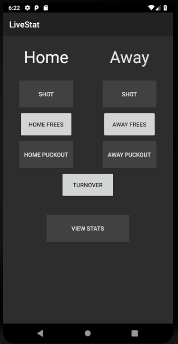

### CA326 - LiveStat - Testing Documentation

*Eimhin Dunne 16386406*

*Adam McElroy 16345753*

**Table of Contents**

1. Interface Testing
2. Unit Testing
3. Firebase Test Lab
4. User Testing
5. Heuristic Analysis

**1. Interface Testing**   

Please see screenshots below of activities on different Android devices. 

Galaxy Nexus 

Nexus 5X

Nexus 6

Nexus 7 Tablet 

Pixel 2XL 

We ran the app on 5 different virtual devices with different screen sizes and the UI adapted to the changes.  No buttons were hidden and the usability of each worked as it should. As we used a verity of screen sizes including a tablet showing that it would work on any device. 

**2. Unit Testing** 

We found that it was essential to unit test the code that was run most often in our programs so we could be assured that it would not crash on runtime. Since our application was made up of a lot of buttons that travelled to new activities we needed to check that each one went to the correct place. The two main things that we needed to assure was that each activity launched without fail. To do this we tested activities in the following way: 

We found a certain element on the activity we wanted to check (eg. Button, TextView) 

Then we imported that element into our Java test file.

Once it was imported we used assertNotNull() on it to prove that it did exist in that activity hence proving we successfully launched the activity. 

We also checked that buttons navigated to the correct locations once clicked. To do this we first made a monitor which was assigned to a certain Activity class. Once the monitor was set up we imported the button which would take us to that activity and again used assertNotNull() to prove it existed. We then performed a click() function on this button which caused the computer to click the button when running the test file. This avoided any bias and proved that the button travelled to the correct activity. Once it switched to the requested activity we once again used assertNotNull() to prove that it did navigate to a working Activity.  

We carried out these steps for the buttons a statistician will use to record stats, how a manager will login and also how a statistician will login to achieve good coverage of both users functions.  

**3. Firebase Test Lab**

We used Firebases build in apk tester. The tester ran through all possible inputs to the app and it passed. The tests were ran on a Pixel as seen below. 

The Crawl graph seen below was produced and shows how the app was stepped through. It shows all the possible moves the app can do between activities. We compared this to our expected output, all moves we expected were true and it did not make any unexpected jumps between activities. It was not able to log into the manager part of the app but this part was tested in the statistician part of the app so it passed these tests. 

Please see the link for video on how it was tested on [Firebase TestLab](https://youtu.be/_t4Tmo2SqKc).

**4.User Testing**

We ran several user tests throughout the project. Games were available on YouTube for controlled testing in the labs and allowed us to run many tests easily. We did this testing ourselves allowing us to find problems that we later fixed. We also tested the app live at county and club games when we felt it was usable in that situation. We then looked to more trained individuals in the field of statistic taking and management. We received both positive and negative  feedback on the app and how we could improve and expand in certain areas. We took the feedback and fixed the problems during the week. We then brought the App back to them the following weekend and got them to use it. This was repeated every week for three weeks until there was no negative user feedback.

**5. Heuristic Analysis** 

As our app is intended to be used by constantly pressing buttons and capturing data we needed to make sure that it was as easy to use as possible. The user would also need to be watching the game at the same time so we wanted to design the user interface so it required little attention to use. To do this we consulted some of Nielsen's Heuristics. These included: 

- Making the buttons large and easy to read

- Having a consistent colour scheme (Dark background with white text)

- Used Green for addition of data to database buttons and Red for subtraction of data. Green usually represents something positive such as addition and red represents negative such as subtraction. 

- To capture the event, choose was it for or against your team and where the event occurred on the pitch only required 3 quick taps of a button before it was fully captured due to the layout we chose for the system.

- The manager only needs to keep track of two screens which display all the data pulled from the database which makes their life a lot easier when using the app. 

