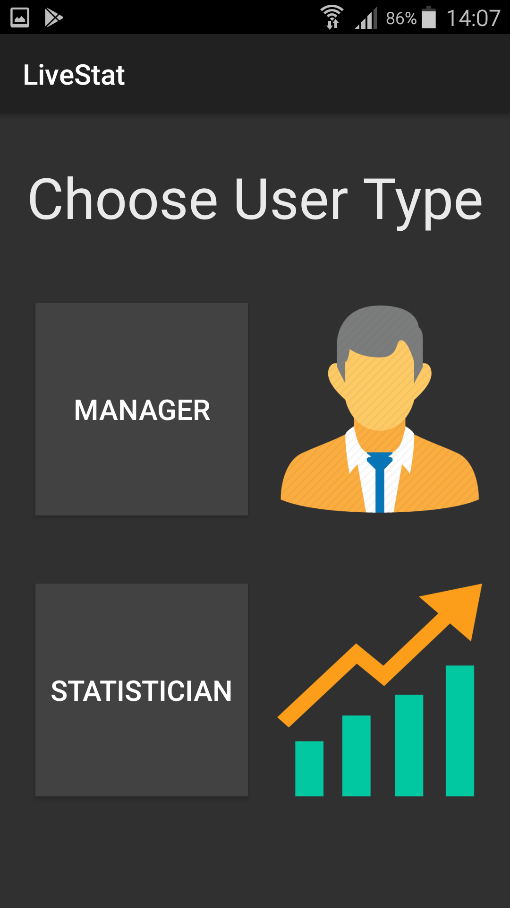
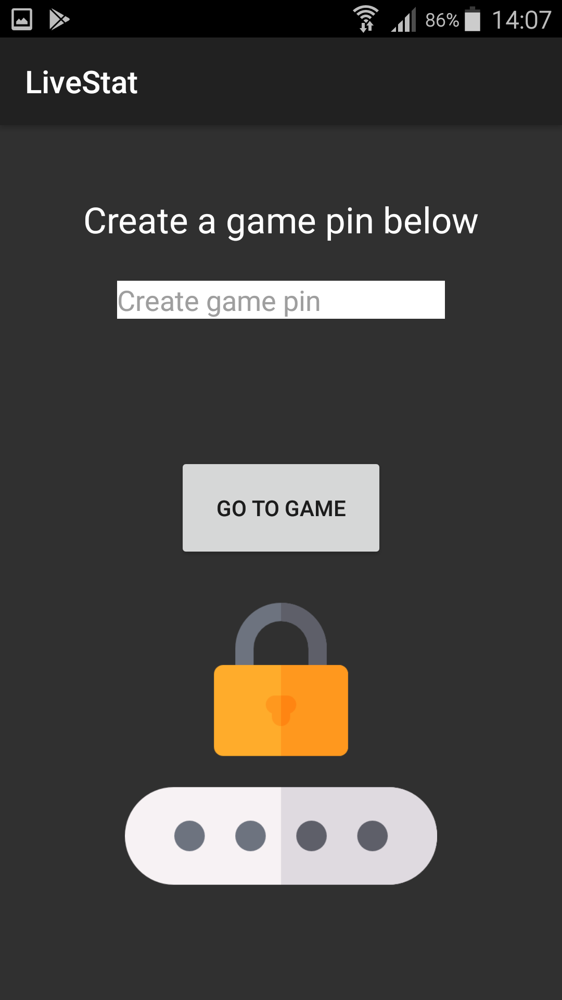
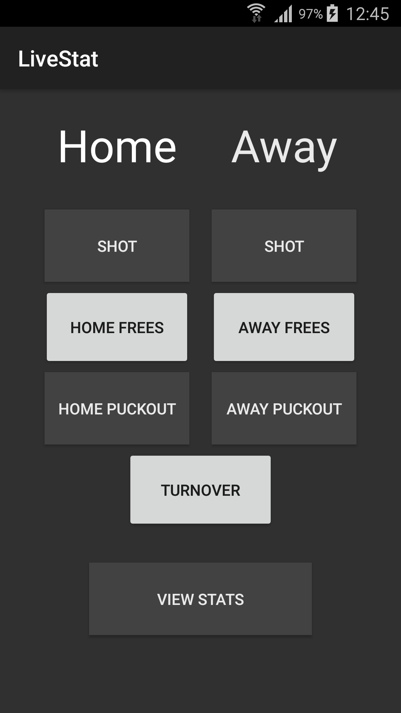
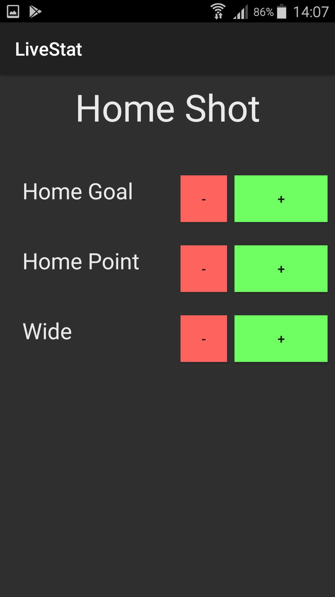
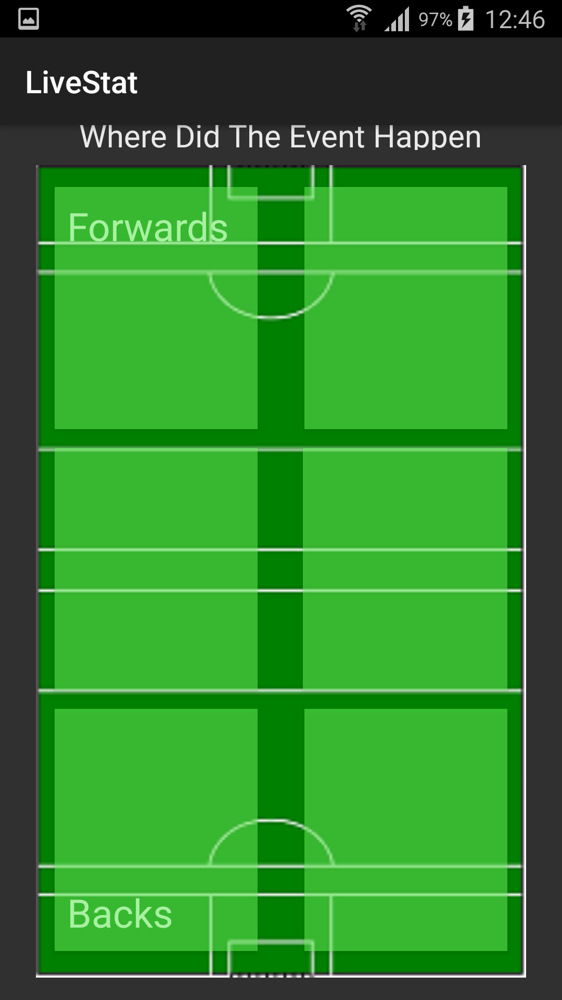
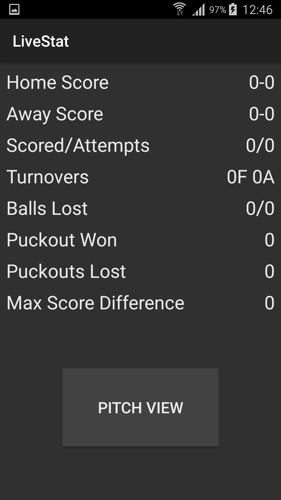
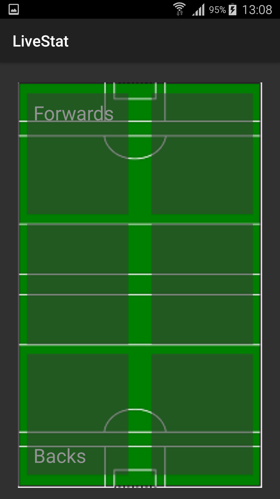
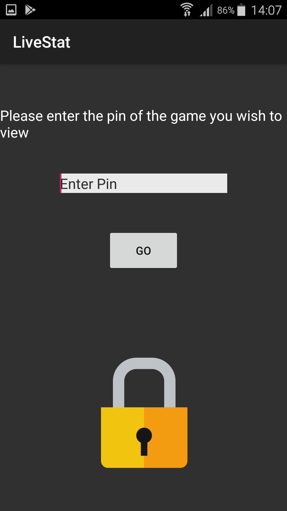

# LiveStat User Manual

**CA326**

Eimhin Dunne & Adam McElroy

### Table of Contents

##### 1. Introduction to LiveStat

##### 2. Getting Started

&nbsp;&nbsp;&nbsp;&nbsp;&nbsp;&nbsp;- 2.1 Download

&nbsp;&nbsp;&nbsp;&nbsp;&nbsp;&nbsp;- 2.2 Create Game

&nbsp;&nbsp;&nbsp;&nbsp;&nbsp;&nbsp;- 2.3 Add Events

&nbsp;&nbsp;&nbsp;&nbsp;&nbsp;&nbsp;- 2.4 View Data

&nbsp;&nbsp;&nbsp;&nbsp;&nbsp;&nbsp;- 2.5 Sign in as Manager

### 1. Introduction 

Welcome to LiveStat, an Android application for tracking and recording your teams performance. This app is designed to be used by managers and other backroom staff of GAA teams. One of the main features of the app is how the data is shared live between multiple devices. With this feature it is possible for one or many users to record events as they happen during a match. These statistics are then stored in a cloud database and are synced in real-time so the manager can view everything that has been recorded be the statisticians. 

In order to get started a statistician must create a game where events can be recorded. They do this by creating a game pin which is decided by them. This acts as a password to gain access to view the statistics so make sure it is something you will remember. This can then be used on the manager side of the app to gain access when prompted. 

Once a game is created and you want to view the statistics all you have to do is login as a manager. As mentioned you need to use the password created before to do this. When you access the game you are presented with a screen with various different statistics. These include things such as scoring effectiveness and turnovers. There is also a button which takes you to the pitch view where you can view where the team is performing well/poorly displayed by green and red zones respectively.

### 2. Getting Started

#### 2.1 Download

- LiveStat is available for download from GitLab at the following directory: https://gitlab.computing.dcu.ie/dunnee49/2019-ca326-dunnee49-livestatistics.git
- Under code/LiveStat you will find an APK file called LiveStat 
- Download it and move it to an Android Device
- Enable Apps to be downloaded from Unknown Sources in the Android device Settings
- Click the APK file that was moved to the device and click "Install"
- Open the app by clicking on it

#### 2.2 Create A Game

To record statistics for a game you must first create the game in which you want to record for. This is done by choosing to be a statistician as they will be the ones doing the recording. Begin by pressing the "STATISTICIAN" button.

Once completed you will be brought to this page where you get to create the game pin. It can be anything you want it to be but make sure you remember it as it will be the pin the manager will use to access viewing of the data captured.

#### 2.3 Record an event

Once the pin creation is complete you will be brought to the main page for taking statistics. Here you will see a lot of buttons falling under Home or Away categories. Each records a certain event which has occurred. For example if your team took a shot on goal you would press the "SHOT" button. 

Once you choose the event that has occurred you need to specify what happened as a result of that event. There are three outcomes of taking a shot in hurling. As you can see here these are that your team scored a goal, a point or the shot went wide. Pick the appropriate event by pressing the green "+" button. There is also a red "-" button which is used in case you press the wrong add button. Its accompanying red button will withdraw the event which was accidently recorded. 

The last process in recording the event is picking where it occurred on the field. As you can see from the below picture the field is broken up into six segments (light green). Pick whichever area the action occurred in and then you will be brought back to the statistic taking page showing that the event was recorded successfully and you can record any further events from here.

#### 2.4 View Data

There are two ways to access the data being recorded during the game. The first way which is displayed in the images below is switching between recording the statistics and viewing them. This can be done on the statisticians home page. You will notice a button at the bottom of the page displaying "VIEW STATS". Press this button to begin.

Once you press the button you will be brought to a page that looks like this. This is one of the areas where all of the data collected is displayed to you. As you can see there are many different ways that the data is being presented which will be beneficial to the manager.

By clicking the "PITCH VIEW" button you will be brought to a page which looks like the image below. This page is very useful to the manager as it displays where the team is performing well and also performing bad. When a statistician records and event and picks the part of the pitch it is registered as a good/bad event by the system, with good being events that benefit your team and bad which negatively impact your team. Depending on how many good/bad events occur in an area will determine that segments colour. A multitude of bad events in one area of the pitch will cause the tile to go red indicating it is a hotspot for bad events while good events cause a tile to go green. The brighter the red is for a bad event area means that your team if majorly struggling in this area and it needs attention.

#### 2.5 Sign in as Manager

This is the second way to view statistics and will probably be more commonly used. If you as a manager wants to view how your team is performing you start off by selecting the "MANAGER" button.

Once complete you will be prompted to enter the pin of the game you wish to view. This is the pin which the statistician created at the beginning of the process.  Once you press "GO" the pin entered will be validated and, if correct, will bring you to the game statistics.

Once again you are brought back to the statistics view of the game which is in progress. You can keep this screen open and while statistics are being taken they will update instantly on this screen so you don't need to worry about tracking them.

